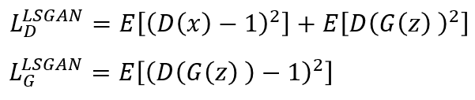

## Generative Adversarial Networks (GAN) Collections

This repository is provides a collection of GAN series and comparison results.
The re-implementations heavily rely on https://github.com/znxlwm/pytorch-generative-model-collections

## Results
*Name* | *Loss Function* | *GIF (100 epoch)*
:---: | :---: | :--- |
**GAN**     |        | 
**LSGAN**   |      | 
**WGAN**    |       | 
**WGAN_GP** |    | 

